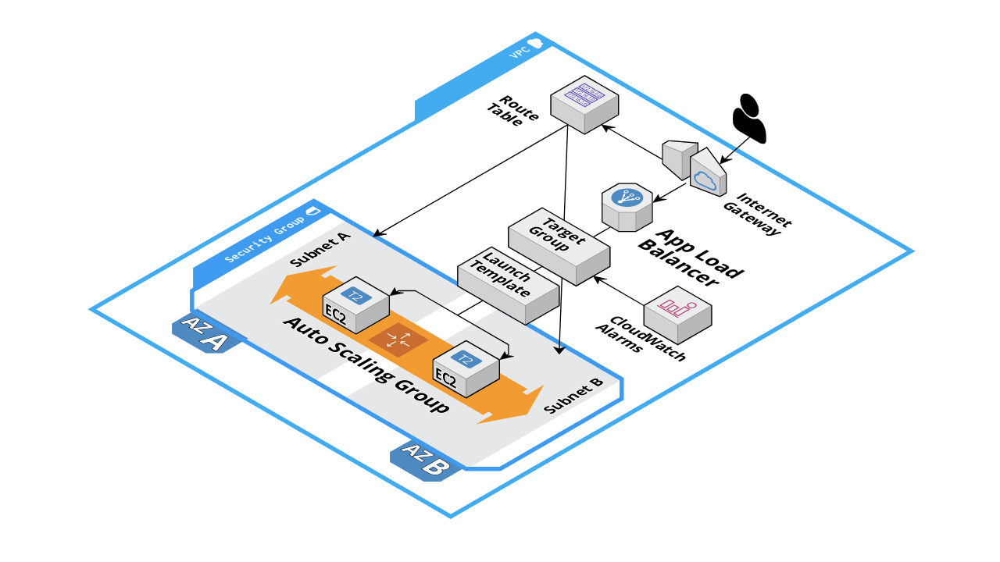

### Examples

#### App Load Balancer + Auto Scaling Group example

On [Subdir app-load-balancer-ec2/](/app-load-balancer-ec2/) an `Application Load Balancer` + `Auto Scaling Group` has been used to create a 
Highly Available application. Which uses `Launch Templates` to auto scale `EC2` instances. 

Auto Scaling is triggered by `CloudWatch Events` depending on `CPU` usage:
* Over 60% CPU usage, increases instances.
* Under 10% CPU usage, decreases instances.

Amount of `Availability Zones` and `Subnets` to deploy the app will be easily defined by variable `subnetsCount`.

#### Todo infrastructure ideas:

- [x] A high availability (multi Availability Zone) app with Auto Scaling Group of EC2 instances.
- [ ] A 3 tier architecture app: web -> backend -> database
- [ ] A serverless app
- [ ] A static website hosted in S3 and available to public.
- [ ] A replicated MongoDB atlas cloud.
- [ ] Make a Bastion 

